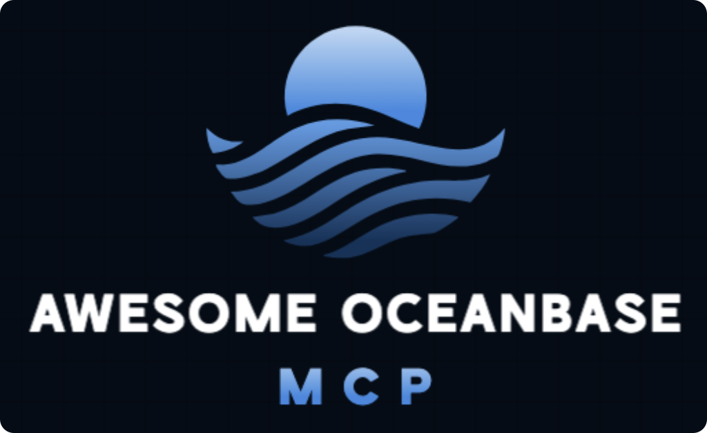

# awesome-mcp-oceanbase

English | [简体中文](README_CN.md)  

OceanBase has a comprehensive solution encompassing the database and its attendant components. This includes OCP (OceanBase Cloud Platform), OBCloud, OKCTL, obdiag, obshell, and more. Through MCP, LLM can interact directly with these components, significantly reducing the learning curve and making them more user-friendly.
This repository contains the MCP Server for OceanBase database and its attendant components.

## 🔗 What is the Model Context Protocol
The Model Context Protocol (MCP) is an open protocol designed to enable seamless integration between LLM applications and external data sources and tools. It serves as a standardized way to connect LLMs with the context they need.

## 🖥️ What is MCP Server
MCP Server is a system that provides context, tools, and prompts to AI clients. It can expose data sources like files, documents, databases, and API integrations, allowing AI assistants to access real-time information in a secure way.

## 💡 Why we need MCP Server
MCP solves the problem of fragmented integrations between AI systems and data sources. It addresses the challenge of AI models being isolated from data and trapped behind information silos, replacing multiple custom implementations with a single universal protocol.

## 🗂️ MCP Servers

This repository contains MCP Servers as following:

| MCP Server           | Description                                                                                            | Document                                |
|----------------------|--------------------------------------------------------------------------------------------------------|-----------------------------------------|
| OceanBase MCP Server | A MCP server that enables secure interaction with OceanBase databases.        | [Doc](src/oceanbase_mcp_server/README.md)      |
| OCP MCP Server       | A MCP server that enables secure interaction with OCP.                        | [Doc](doc/ocp_mcp_server.md)            |
| OBCloud MCP Server   | A MCP server that enables secure interaction with OBCloud.                    | [Doc](src/obcloud_mcp_server/README.md) |
| OKCTL MCP Server     | A MCP server that enables secure interaction with OceanBase resources in k8s. | [Doc](doc/okctl_mcp_server.md)          |
| obdiag MCP Server    | A MCP server that enables secure interaction with obdiag.                     | [Doc](doc/obdiag_mcp_server.md)         |
| obshell MCP Server   | A MCP server that enables secure interaction with obshell.                     | [Doc](doc/obshell_mcp_server.md)         |

If you're interested in the MCP Server for a particular component, you can click the Doc link for each component to view detailed information.

## Community

Don’t hesitate to ask!

Contact the developers and community at [https://ask.oceanbase.com](https://ask.oceanbase.com) if you need any help.

[Open an issue](https://github.com/oceanbase/mcp-oceanbase/issues) if you found a bug.

## Licensing

See [LICENSE](LICENSE) for more information.
