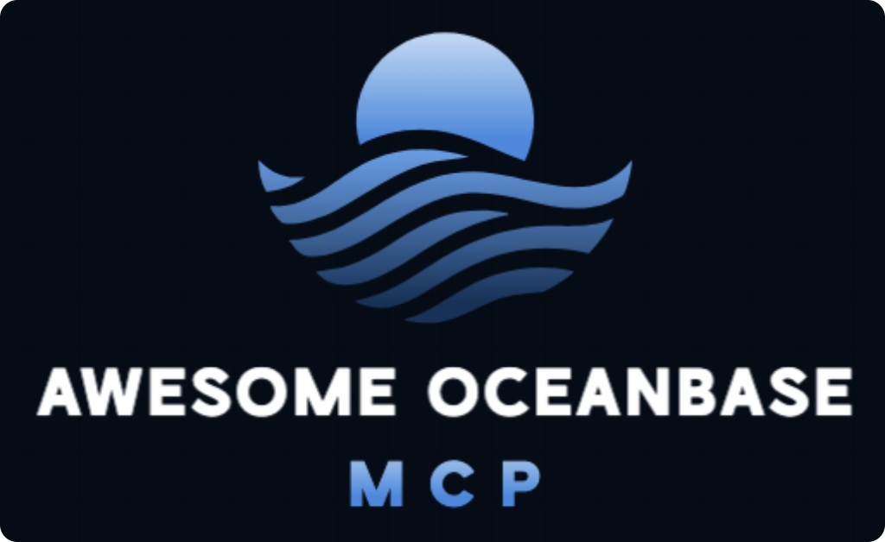

# awesome-mcp-oceanbase

[English](README.md) | 简体中文

OceanBase 包含数据库本身和它的周边组件。包括 OCP (OceanBase Cloud Platform)、 OBCloud、OKCTL、obdiag、obshell 等。通过 MCP，大模型可以直接和这些组件交互，显著地降低了使用难度，对用户更为友好。
这个仓库包含了 OceanBase 数据库和它周边组件的 MCP Server。

## 🔗 什么是模型上下文协议
模型上下文协议（MCP）是一种开放协议，旨在实现大型语言模型（LLM）应用与外部数据源及工具的无缝集成。它作为连接LLM与其所需上下文的标准化方式。

## 🖥️ 什么是 MCP Server
MCP服务器是一个为AI客户端提供上下文、工具和提示的系统。它能够暴露文件、文档、数据库和API集成等数据源，使AI助手能够以安全的方式访问实时信息。

## 💡 为什么我们需要 MCP Server
MCP解决了人工智能系统与数据源之间集成碎片化的问题。它突破了人工智能模型与数据隔离、困于信息孤岛的困境，通过单一通用协议取代了多种定制化实现方案。

## 🗂️ MCP Servers

本仓库提供了如下 MCP Server：

| MCP Server           | 描述                                      | 使用文档                                    |
|----------------------|-----------------------------------------|-----------------------------------------|
| OceanBase MCP Server | 一个可以和 OceanBase 数据库安全交互的MCP Server。     | [Doc](src/oceanbase_mcp_server/README_CN.md)      |
| OCP MCP Server       | 一个可以和 OCP 交互的 MCP Server。               | [Doc](doc/ocp_mcp_server_CN.md)         |
| OBCloud MCP Server   | 一个可以和 OBCloud 交互的 MCP Server。           | [Doc](src/obcloud_mcp_server/README.md) |
| OKCTL MCP Server     | 一个可以和 OceanBase 资源在 k8s 交互的 MCP Server。 | [Doc](doc/okctl_mcp_server_CN.md)       |
| OBDIAG MCP Server    | 一个可以和 obdiag MCP Server。                | [Doc](doc/obdiag_mcp_server_CN.md)      |
| obshell MCP Server   | 一个可以通过 obshell 创建和运维 OceanBase 集群的 MCP Server。         | [Doc](doc/obshell_mcp_server_CN.md)     |

如果你对某个组件的 MCP Server 感兴趣，可以点击每个组件的 Doc 链接，查看详细信息。

## 社区

当你需要帮助时，你可以在 [https://ask.oceanbase.com](https://ask.oceanbase.com) 上找到开发者和其他的社区伙伴。

当你发现项目缺陷时，请在 [issues](https://github.com/oceanbase/mcp-oceanbase/issues) 页面创建一个新的 issue。

## 许可证

更多信息见 [LICENSE](LICENSE)。
